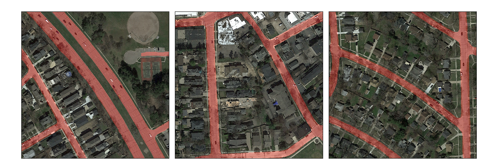

# CleanRoad: Road Segmentation of Aerial Images by Fusing Modern and Traditional Methods

<div align="center">

</div>

## Table of Contents
* [About the Project](#about-the-project)
* [Folder Structure](#folder-structure)
* [Images](#images)
* [Getting Started](#getting-started)
  * [Download missing data](#download-missing-data)
  * [Prerequisites](#prerequisites)
* [Usage](#usage)
  * [Run the code](#run-the-code)
  * [Reproduce our results](#reproduce-our-results)
    * [Train and predict results](#train-and-predict-results)
    * [Predict using pretrained models](#predict-using-pretrained-models)

## About The Project
This repository contains the source code for the graded semester project for the [Computational Intelligence Lab 2020 lecture](http://da.inf.ethz.ch/teaching/2020/CIL/) at ETH Zurich.
Please follow the instructions below to get started and reproduce our results.
Read the [paper](https://github.com/winbergs/CILlitbang/blob/master/report.pdf) for more information about our experiments and design decisions.

Our final model is a dilated U-Net with transposed convolutional layers and has the following structure:

<div align="center">

</div>

Furthermore, we constructed the following dedicated post-processing pipeline to further refine and cleanup the results.

<div align="center">

</div>

## Folder Structure
```
├── README.md
├── data                                             
│   ├── test                                          - 94 test images provided for the project
│   │   └── images
│   ├── training                                      - 199 training images (provided and additional data)
│   │   ├── groundtruth
│   │   └── images
│   ├── training_original                             - 90 of the 100 training images provided for the project
│   │   ├── groundtruth
│   │   └── images
│   ├── validation                                    - 22 validation images (provided and additional data)
│   │   ├── groundtruth
│   │   └── images
│   └── validation_original                           - 10 validation images taken from the 100 training images provided for the project
│       ├── groundtruth
│       └── images
├── final_experiments                                 - Results of experiments in report       
│   ├── architectures                                      - Model architecture experiments
│   ├── models                                             - Directory for model weights of models (see README in directory for download instructions)
│   └── refinements                                        - Refinement experiments
├── notebook                                          
│   ├── post_processing.ipynb                         - Jupyter notebook for the visualization of post-processing steps
│   └── test_results_comparison.ipynb                 - Jupyter notebook for the comparison of different predictions
├── plots                                             - Figures in report
│   ├── comparisons                                        - Comparison figures
│   └── diagrams                                           - Illustrations diagrams 
├── environment.yml                                   - YAML file for conda environment setup
├── out                                               - Created directory. Contains model weights, predictions, config file and submission file after completed run
└── src
    ├── argparser.py                                  - Argumentparser for command line arguments
    ├── baselines                                     - Separate baseline architectures
    │   ├── basic_cnn                                 - Baseline from CIL 2020 exercise 9 (results not included in report)
    │   │   ├── tf_aerial_images.py                        - Code to execute for this baseline
    │   │   ├── tf_aerial_images_submission.py             - Creates submission file for this baseline (is called from tf_aerial_images.py)
    │   │   └── training                                   - 100 provided training images for the project 
    │   │       ├── groundtruth
    │   │       └── images
    │   └── keras_segmentation                        - Baseline from https://github.com/divamgupta/image-segmentation-keras (using resnet50_unet model)
    │       ├── keras_seg.py                               - Code to execute for this baseline
    │       └── keras_seg_submission.py                    - Creates submission file for this baseline (is called from keras_seg.py)
    ├── data
    │   ├── result_prediction.py                      - Creates predictions of test images
    │   ├── data.py                                   - Prepares data for all models except patch-based
    │   ├── data_patch.py                             - Prepares data for patch-based U-Net
    │   ├── helper.py                                 - Helper functions for the other files in this directory
    │   ├── post_processing.py                        - Post-processing functions
    │   └── tensorboard_image.py                      - TensorBoard Callback
    ├── main.py                                       - Main function for all models except patch-based
    ├── main_patch.py                                 - Main function for patch-based U-Net
    ├── models
    │   ├── loss_functions.py                         - Custom loss functions and callback metrics
    │   ├── unet.py                                   - Original U-Net model from https://github.com/zhixuhao/unet (serves as baseline in the report)
    │   ├── unet_dilated_v1.py                        - U-Net dilated v1
    │   ├── unet_dilated_v1_transposed.py             - U-Net dilated v1 with transposed convolutions
    │   ├── unet_dilated_v2.py                        - U-Net dilated v2
    │   ├── unet_dilated_v2_transposed.py             - U-Net dilated v2 with transposed convolutions
    │   ├── unet_dilated_v2_transposed_patch.py       - U-Net dilated v2 with transposed convolutions, adapted for patch-based model
    │   └── unet_patch.py                             - Original U-Net model, adapted for patch-based model
    └── submission
        ├── log_submission.py                         - Prepares submission directory (see 'out' directory)
        ├── mask_to_submission.py                     - Provided code to create submission file from binary mask
        └── submission_to_mask.py                     - Provided code to create binary mask from submission file
```
## Images
All training and validation images are from the chicago dataset from https://zenodo.org/record/1154821#.XyPssSgzaUk. Out of the total 221 images, 100 have been provided for the project and 121 have been selected by us. They all have been thoroughly investigated to not contain any parts of the test images.

## Getting Started
### Download missing data
Due to the size limit for the final submission, the content of the data/ and final_experiments/ directories has been moved to polybox. Please download them from the following [polybox link](https://polybox.ethz.ch/index.php/s/3IrRQ6vBsY1osdT). If you want to also make predictions on our trained models, please also download the two folders from [this link](https://polybox.ethz.ch/index.php/s/61AMzol0pBlbKCl) and put them into the final_experiments/models/ directory. More information is also provided [here](https://github.com/winbergs/CILlitbang/blob/master/final_experiments/models/README.md).

### Prerequisites
- Please consult the [Conda Installation Guide](https://docs.conda.io/projects/conda/en/latest/user-guide/install/#regular-installation) for more information.
  If you want to run this code on the Leonhard Cluster, please follow the relevant parts of [this tutorial](http://kevinkle.in/jekyll/update/2019/02/28/leonhard.html)
- Create and activate the virtual environment
  ```
  conda env create -f environment.yml
  conda activate tf2
  ```
  Of course, you can give the environment a custom name with the `-- name ` flag.

## Usage
### Run the code
Once the virtual environment is activated you can run the code as follows:
- Go into the `src` directory.
  ```sh
  cd src/
  ```
- Run the program
  ```sh
  python main.py
  ```
- Setting parameters with flags
  - Getting help
    ```sh
    python main.py --help
    ```
  - Example: Start a run with 30 training epochs
    ```sh
    python main.py --epochs=30
    ```
  - However, we recommend using the config template by modifying it.
    Edit the file and set the parameters accordingly. To start a run with a config file as input type
    ```sh
    python main.py -c <PATH_TO_CONFIG>
    ```
 - If you want to run this code on the Leonhard cluster submit your jobs with 8GB of memory. Examples:
   ```sh
   bsub -W 8:30 -R "rusage[ngpus_excl_p=1,mem=8192]" "python main.py -c config.cfg"
   ```
   or alternatively, if you have a longer `<PATH_TO_CONFIG>` with e.g. whitespaces
   ```sh
   bsub -W 8:30 -R "rusage[ngpus_excl_p=1,mem=8192]" "python main.py -c \"<PATH_TO_CONFIG>\""
   ```
   
To run the models for our patch-based approaches and the keras_segmentation baseline, follow the steps below:
 - For our patch-based approach, please follow the steps from above and replace `main.py` with `main_patch.py`.
 - For keras_segmentation, please call `cd src/baselines/keras_segmentation` instead and then submit the following job (Note that the results will be under src/baselines/keras_segmentation/results):
   ```sh
   bsub -W 8:30 -R "rusage[ngpus_excl_p=1,mem=8192]" "python keras_seg.py"
   ```


### Reproduce our results
Reproducing the results of our paper can be done easily. We provide predefined config files that we used for our runs. These include fixed random seeds that worked well in our experiments. While exact reproduction of results is not possible when executing tensorflow code on a GPU, they should still be very similar when taking the same seed in different runs.
#### Train and predict results
Pick the experiment you want to reproduce and select the corresponding config file. Under `final_experiments/architectures` and `final_experiments/refinements` you will find directories that are named like our experiments in the report along with number of epochs and steps per epoch. For all experiments you will find config files named `config.cfg` that you can use (except for the keras_segmentation baseline that runs without config file). Follow the above instructions on how to use config files with our code and let the job run.
#### Predict using pretrained models
To download the model weights please follow the instructions from https://github.com/winbergs/CILlitbang/blob/master/final_experiments/models/README.md. Follow the above instructions on how to use config files with our code. Now modify the corresponding config file and set the `train-model` parameter to `False` and set the `model-path` parameter to the model weights you want to use. Now, let the job run.
#### Find the results
The directory `out` in the root folder will be created and will contain a summary of all your submitted runs. You can check the date, as well as the description in the directory name to identify a specific run/submission. Each submission directory will have the following structure:
```
- config.cfg            - Config file with all relevant parameter information
- discrete/             - Binary masks of results without post-processing
- continuous/           - Probabiliy masks of results without post-processing
- discrete_post/        - Binary masks of results with post-processing
- continuous_post/      - Probabiliy masks of results with post-processing
- submission.csv        - Submission file for Kaggle without post-processing
- submission_post.csv   - Submission file for Kaggle with post-processing
- tensorboard/fit/      - Tensorboard plot and intermediate image result data
- <MODEL_NAME>.h5       - Trained model weights file in .h5 format
```
The result binary masks in `discrete` and `discrete_post` can then be compared with the respective results within the `final_experiments` folder. Note that a markdown file within each experiment hints at which results and .csv file should be used, the one without or with post-processing.
